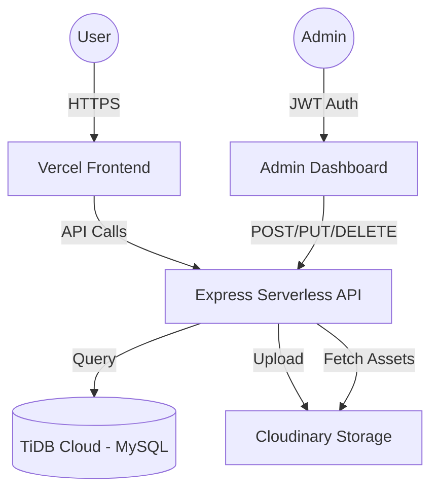

# 🎮 Pixel Quest - Personal Portfolio

<div align="center">
  
  <h3>Kiki Aimar Wicaksana</h3>
  <p>Data Engineer | Cloud & Data Enthusiast</p>
  <a href="https://kikiaimarwicaksana.vercel.app"><strong>View Live Website »</strong></a>
</div>

---

## 🚀 Overview

**Pixel Quest** is a professional, gamified portfolio website designed with a modern pixel-art aesthetic. It showcases projects, achievements, and digital products, featuring a full-stack architecture with a custom admin dashboard for content management.

## 🛠️ Tech Stack

### Frontend
- **React.js**: Core framework for a dynamic SPA experience.
- **React Router**: For seamless navigation and admin routing.
- **Vanilla CSS**: Custom-crafted pixel-art design system.
- **Vite**: Ultra-fast build tool and development server.

### Backend
- **Node.js & Express**: Scalable serverless API layer.
- **TiDB Cloud**: Distributed MySQL database for reliable data storage.
- **Cloudinary**: Cloud-based image management and optimization.
- **JWT**: Secure token-based authentication for the admin dashboard.

### Deployment & DevOps
- **Vercel**: High-performance hosting for both Frontend and Serverless Functions.
- **GitHub Actions**: Continuous Deployment (CD) pipeline.

## 🏗️ Architecture



## ✨ Features

- **Gamified UI**: Experience system (XP), pixel-art animations, and quest-themed sections.
- **Admin Dashboard**: Secure management of portfolio items and activities.
- **Cloudinary Integration**: Automatic image optimization and cloud storage (no local `uploads/` folder).
- **Responsive Design**: Optimized for desktop and mobile devices.
- **Floating Shop Bubble**: Interactive digital product showcase.

## 📦 Project Structure

```text
├── backend/
│   ├── server.js       # Main API server & Serverless Entry
│   ├── db.js           # Database connection (TiDB)
│   ├── vercel.json     # Backend deployment config
│   └── package.json
├── frontend/
│   ├── src/
│   │   ├── components/ # Reusable UI components
│   │   ├── pages/      # Main pages & Admin Dashboard
│   │   ├── sections/   # Home page sections
│   │   └── App.jsx     # Routing & Core logic
│   ├── vercel.json     # SPA routing config
│   └── vite.config.js
└── .env                # Environment Variables (Shared)
```

## ⚙️ Local Setup

1. **Clone the repo:**
   ```bash
   git clone https://github.com/KikiAimarWicaksana/Personal_website.git
   ```

2. **Backend Setup:**
   ```bash
   cd backend
   npm install
   # Configure .env with DATABASE_URL, JWT_SECRET, and CLOUDINARY credentials
   npm run dev
   ```

3. **Frontend Setup:**
   ```bash
   cd frontend
   npm install
   # Set VITE_API_URL in .env
   npm run dev
   ```

---

<p align="center">Built with 💚 by Kiki Aimar Wicaksana</p>
