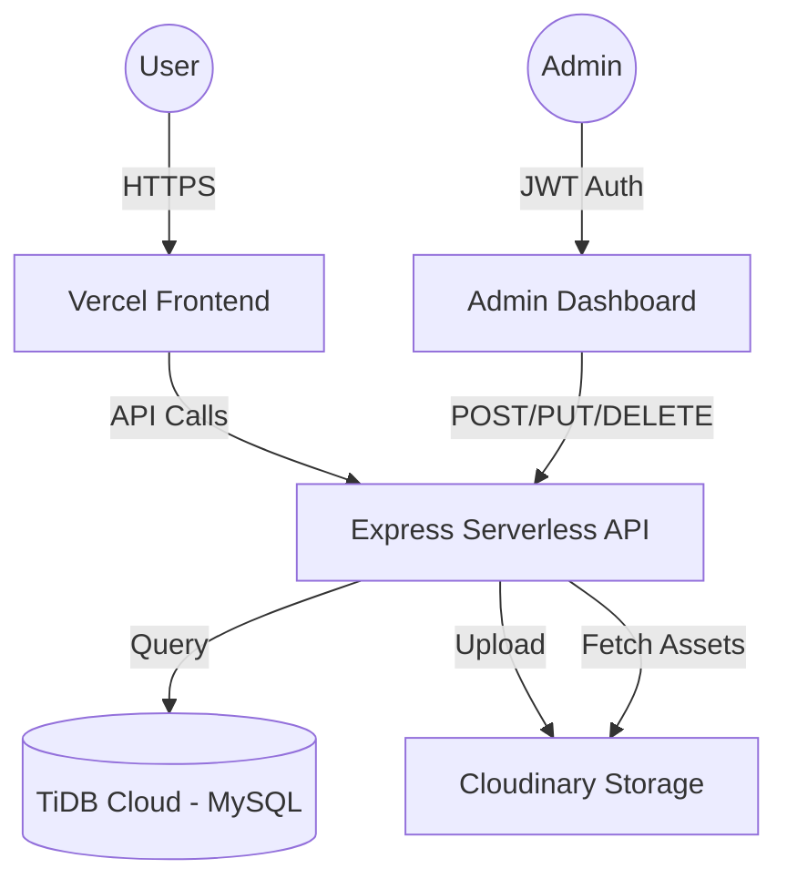

# 🎮 Pixel Quest - Personal Portfolio

<div align="center">
  
  <h3>Kiki Aimar Wicaksana</h3>
  <p>Data Engineer | Cloud & Data Enthusiast</p>
  <a href="https://aimar.my.id"><strong>🚀 View Live Website »</strong></a>
</div>

---

## 🕹️ Overview

**Pixel Quest** is a professional, gamified portfolio website designed with a modern pixel-art aesthetic. It showcases projects, achievements, and digital products, featuring a full-stack architecture with a custom admin dashboard for content management.

## 🛠️ Tech Stack

### Frontend
- **React.js**: Core framework for a dynamic SPA experience.
- **React Router**: For seamless navigation and admin routing.
- **Vanilla CSS**: Custom-crafted pixel-art design system.
- **Vite**: Ultra-fast build tool and development server.

### Backend
- **Node.js & Express**: Scalable serverless API layer.
- **TiDB Cloud**: Distributed MySQL database for reliable data storage.
- **Cloudinary**: Cloud-based image management and optimization.
- **JWT**: Secure token-based authentication for the admin dashboard.

### Deployment & DevOps
- **Vercel**: High-performance hosting with modern serverless functions.
- **GitHub**: Source control and CI/CD integration.

## 🏗️ Architecture



## ✨ Features

- **🏆 Gamified UI**: Experience system (XP), pixel-art animations, and quest-themed sections.
- **🛡️ Admin Dashboard**: Secure management of portfolio items and activities.
- **☁️ Cloudinary Integration**: Automatic image optimization and cloud storage.
- **📱 Responsive Design**: Fully optimized for desktop, tablet, and mobile devices.
- **🛒 Floating Shop Bubble**: Interactive showcase for digital products.

## 📦 Project Structure

```text
├── api/
│   └── index.js        # Vercel Serverless Function entry point
├── backend/
│   ├── server.js       # Main Express app logic
│   ├── db.js           # Database connection (TiDB Cloud)
│   └── initDB.js       # Database initialization script
├── frontend/
│   ├── src/            # React components, pages, and sections
│   ├── public/         # Static assets
│   └── package.json    # Frontend dependencies
├── package.json        # Root dependencies (shared with backend)
└── vercel.json         # Consolidated Vercel routing & config
```

## ⚙️ Local Setup

1. **Clone the repo:**
   ```bash
   git clone https://github.com/KikiAimarWicaksana/Personal_website.git
   ```

2. **Installation:**
   ```bash
   # From the root directory
   npm run install-all
   ```

3. **Configure Environment:**
   Create a `.env` file in the root with:
   - `DATABASE_URL`: Your TiDB connection string
   - `JWT_SECRET`: Secret key for authentication
   - `CLOUDINARY_URL`: Cloudinary credentials

4. **Run Development Server:**
   ```bash
   # Start backend
   cd backend && npm run dev
   
   # Start frontend
   cd frontend && npm run dev
   ```

## 🚀 Deployment (Vercel)

- **Root Directory**: Leave blank or set to `./`.
- **Output Directory**: Set to `frontend/dist`.
- **Environment Variables**: Ensure all `.env` variables are added to the Vercel dashboard.

---

<div align="center">
  <p>Built with 💚 by <strong>Kiki Aimar Wicaksana</strong></p>
  <a href="https://linkedin.com/in/kikiaimarwicaksana">LinkedIn</a> | 
  <a href="https://github.com/kikiaimarwicaksana">GitHub</a> | 
  <a href="mailto:wicaksanakikiaimar@gmail.com">Email</a>
</div>
